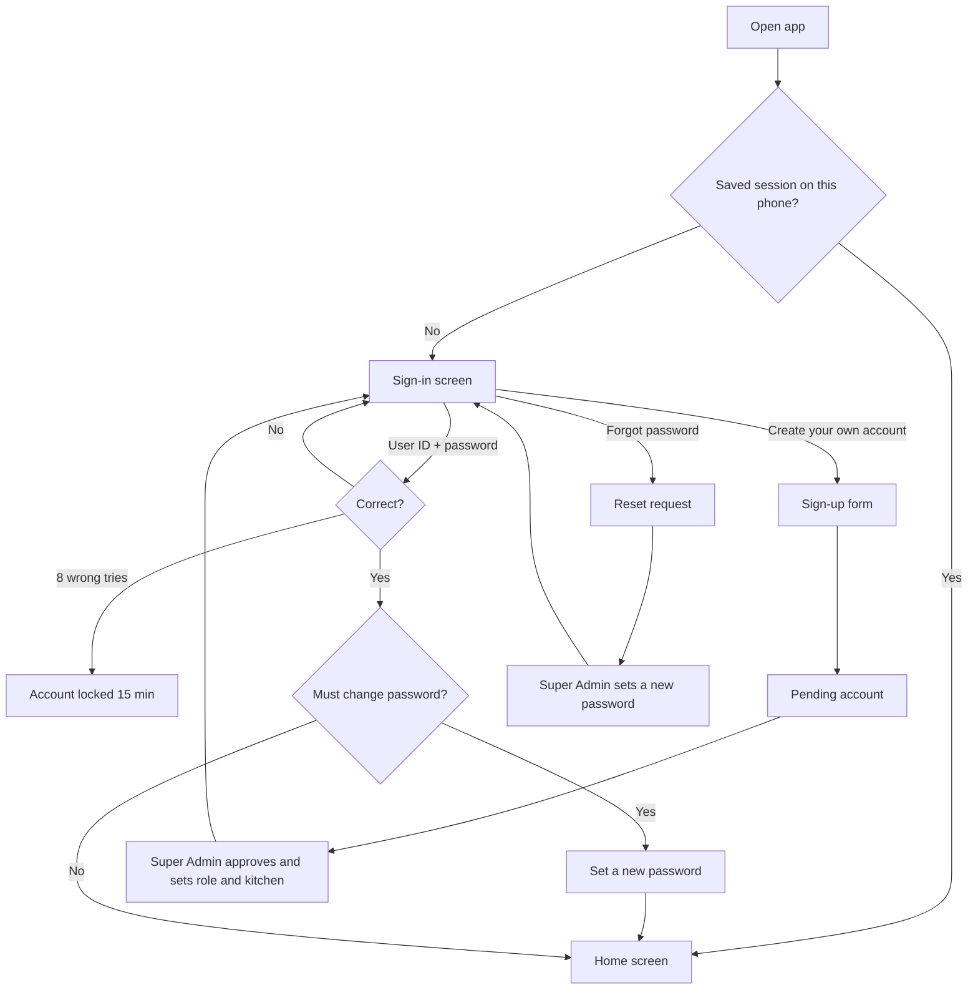
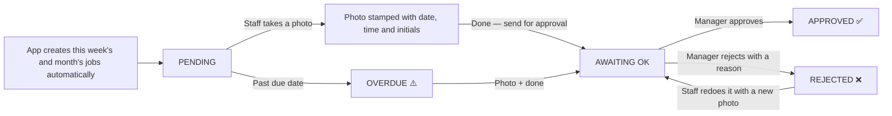
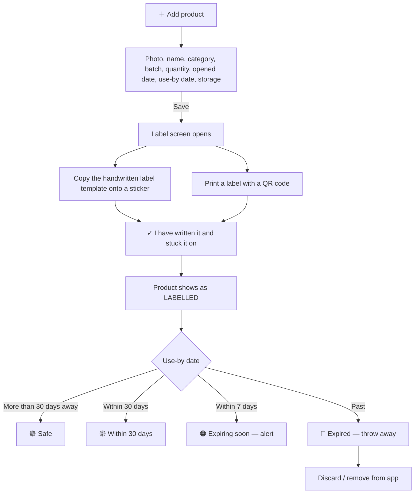
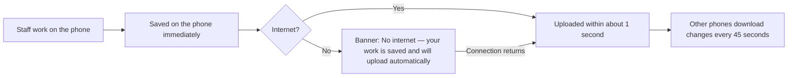

# Bookends Kitchen Compliance App — Application Flow & Use-Case Document

| | |
|---|---|
| **Application** | Bookends Kitchen Compliance (web app, installable on phones) |
| **Version** | 1.0 |
| **Document date** | 19 September 2026 |
| **Prepared by** | garvi-bookends |
| **Status** | Built and working; pre-launch (deployment and clean-up items listed in section 13) |
| **Technical setup guide** | See [SETUP.md](SETUP.md) |

---

## Table of contents

1. [Executive summary](#1-executive-summary)
2. [Kitchens covered](#2-kitchens-covered)
3. [Users, roles and permissions](#3-users-roles-and-permissions)
4. [End-to-end flows](#4-end-to-end-flows)
5. [Screen-by-screen guide](#5-screen-by-screen-guide)
6. [How compliance scores are calculated](#6-how-compliance-scores-are-calculated)
7. [Cleaning checklist](#7-cleaning-checklist)
8. [Data, storage and sync](#8-data-storage-and-sync)
9. [Security](#9-security)
10. [Technology and deployment](#10-technology-and-deployment)
11. [API summary (technical appendix)](#11-api-summary-technical-appendix)
12. [Integrations](#12-integrations)
13. [Current status, known gaps and next steps](#13-current-status-known-gaps-and-next-steps)
14. [Glossary](#14-glossary)

---

## 1. Executive summary

The Bookends Kitchen Compliance App replaces paper checklists and verbal follow-ups with one phone-first app used by every kitchen. Staff and managers open it in a phone browser, or add it to the home screen like a normal app. It covers four areas of food-safety compliance:

| Pillar | What it does |
|---|---|
| **1. Deep cleaning** | Weekly and monthly cleaning jobs are created automatically for every kitchen. Each job needs a **photo as proof** and a **manager's approval**. |
| **2. Expiry control** | Every opened or received product is recorded with batch, storage place and use-by date. The app flags what is **expired** or **expiring soon**. |
| **3. Labelling** | Every product gets a label, either handwritten from an on-screen template or printed with a **QR code** that opens the product in the app. |
| **4. Compliance reporting** | Live scores per kitchen and per city, a violations list, staff performance, photo evidence, **Print/PDF** and **CSV export**. |

**Key benefits**

- **Proof, not promises:** no cleaning job or product can be completed without a date-stamped photo.
- **Accountability:** the app records who did each job, who approved or rejected it, and when.
- **One view of all kitchens:** head office sees a league table of all 8 kitchens and a Surat vs Ahmedabad comparison.
- **Works offline:** after signing in, staff can keep working without internet, and their work uploads when the connection returns.
- **Role-based access:** each person sees only what their role allows, and the server enforces those rules.

---

## 2. Kitchens covered

There are 8 kitchens in 2 cities. All of them use electric equipment only (no gas), and the cleaning checklist is written for that.

| Code | Kitchen | City | Kitchen head |
|---|---|---|---|
| SPK | Surat Prep Kitchen | Surat | Rahul |
| CPP | Capiche Piplod | Surat | Amisha |
| CPV | Capiche Vesu | Surat | Rahil |
| AKP | Aiko Pal | Surat | Harish |
| APK | Ahmedabad Prep Kitchen | Ahmedabad | Raju |
| CPA | Capiche Ambli | Ahmedabad | Pankaj |
| CPU | Capiche Uni | Ahmedabad | Atul |
| AKA | Aiko Ambli | Ahmedabad | Akshay |

---

## 3. Users, roles and permissions

| Role | Who it is for | Sees | Can approve cleaning | Can manage users | Read-only |
|---|---|---|---|---|---|
| **Super Admin** | One owner account (Husen) | All kitchens | ✅ | ✅ (plus sign-up approvals and password resets) | — |
| **Execution Head** | Head office | All kitchens | ✅ | ✅ | — |
| **Assistant Execution Head** | Head office | All kitchens | ✅ | ✅ | — |
| **Admin** | Office admin | All kitchens | ✅ | ✅ | — |
| **Head of Kitchen** | Senior chef across kitchens | All kitchens | ✅ | — | — |
| **Location Manager** | One kitchen's manager | Own kitchen only | ✅ | — | — |
| **Kitchen Staff** | Cooks and helpers | Own kitchen only | — | — | — |
| **Auditor** | Internal or external auditor | All kitchens | — | — | ✅ (view and reports only) |

**Rules**

- **Only one Super Admin can exist**, and the database itself enforces this. The role can't be given from inside the app; it is set on the server. Nobody else can edit, reset or delete the Super Admin.
- **Only the Super Admin** can approve or reject self sign-ups and handle "Forgot password" requests.
- **The server enforces every rule**, not just the screen:
  - staff and managers can only read and write their own kitchen's data
  - the Auditor is blocked from all changes
  - nobody can delete or demote themselves, and the last user-manager can't be removed
- **Kitchen Staff don't see the Reports tab.**

**Accounts at launch** are Husen Khan (Execution Head), Manish and Rutvik (Assistant Execution Heads), one Location Manager per kitchen, and the Super Admin account.

---

## 4. End-to-end flows

### 4.1 Sign-in and account flow

1. **First-time users** sign in with their user ID (their first name in lower case) and the starting password issued by an admin. They must then choose their own password.
2. **Self sign-up:** a new person enters their name, username, kitchen and password. The account stays **pending** until the Super Admin approves it and gives it a role and kitchen.
3. **Forgot password:** there's no email or SMS. The request appears on the Super Admin's dashboard, and the Super Admin sets a new password and passes it on.
4. **Staying signed in:** a phone stays signed in for **30 days**. Signing in always needs internet.

### 4.2 Cleaning flow (weekly and monthly deep clean)

1. **Jobs are created automatically** for all 8 kitchens:
   - **Weekly jobs** (33) are spread across the week. "Housekeeping area cleaning" always falls on **Tuesday**.
   - **Monthly heavy jobs** (13) are spread across the month, from the 6th to the 28th.
   - Jobs are assigned to the kitchen's manager, but **anyone in that kitchen can do them**, and the app records who did.
2. **Staff open a job, take a photo** with the phone camera (compulsory). The app stamps the photo with the date, time and the person's initials.
3. The staff member taps **"✓ Done — send for approval"**. This button only appears once a photo exists.
4. **A manager (or anyone with approval rights) approves it, or rejects it with a reason.** A rejected job goes back to the staff member's to-do list.
5. Everything counts towards the kitchen's **cleaning score**.

### 4.3 Product, expiry and labelling flow

1. **Add a product**. The form has:
   - **photo (compulsory)** and name
   - category (Dairy, Meat & Poultry, Seafood, Produce, Sauces & Prep, Dry Goods, Frozen, Bakery, Beverage)
   - batch number (filled in automatically)
   - quantity and unit
   - opened/received date and use-by date, with quick buttons for +1, 2, 3, 5, 7, 14 and 30 days
   - storage place (Chiller 1/2, Walk-in Chiller, Freezer, Dry Store, Ambient Prep, Bar Fridge)
2. **Checks on save:** the name and photo are required, and the use-by date can't be earlier than the opened date.
3. **Label:** the label screen opens straight away. Staff either write the label by copying the large on-screen template, or print it. Printed labels have a QR code, product ID, dates, batch, quantity, storage, initials and kitchen code.
4. Staff confirm **"I have written it and stuck it on"**, and the product counts as labelled.
5. The app **colour-codes every product by expiry** and raises alerts. Expired products appear under "Throw these away 🔴" on the staff home screen.
6. When a product is used up or thrown away, staff **discard** it in the app.

### 4.4 QR label scan flow

1. Any phone camera pointed at a printed label opens the app on **that exact product**.
2. Inside the app, **Scan a label** uses the camera where the phone supports it. iPhone users are told to use the normal Camera app instead. Staff can also type the label code by hand.

### 4.5 Alerts flow

Tapping the **bell** shows alerts, most urgent first:

1. Cleaning overdue
2. Photo missing
3. Task rejected
4. Awaiting approval
5. Product expired
6. Expiring within 7 days
7. Label missing

Tapping an alert opens the job or product so it can be fixed. "Mark all as read" clears the badge.

### 4.6 Reporting flow

1. A manager or head-office user opens **Reports** and picks **This week** or **Last 4 weeks**.
2. The report shows:
   - the group score
   - a kitchen-by-kitchen table
   - Surat vs Ahmedabad
   - violations
   - staff compliance
   - up to 24 photos as evidence
3. **🖨 Print / PDF** gives a printable report with the date and the name of the person who printed it.
4. **⤓ Export CSV** downloads a spreadsheet with one row per kitchen per week.

### 4.7 Offline and sync flow

- Photos taken offline are kept on the phone and uploaded automatically later.
- If two phones edit the same record, **the newest edit wins**. An edit that hasn't been uploaded yet is never overwritten.

---

## 5. Screen-by-screen guide

The tab bar at the bottom has **Home · Cleaning · Expiry · Labels · Reports**. On a desktop or tablet 900px wide or more, it moves to a left sidebar. The header has a **kitchen selector** (head-office roles can pick "All 8 locations"), the **alerts bell**, and the **profile** button.

### 5.1 Home

**Kitchen Staff** get a simple screen with four big buttons:

| Button | Shows |
|---|---|
| **CLEANING** | Number of jobs to do |
| **LABEL A PRODUCT** | — |
| **CHECK EXPIRY** | Number expired or expiring |
| **SCAN A LABEL** | — |

Below the buttons are "Jobs still to do this week" and "Throw these away 🔴".

**Managers and head office** get a dashboard:

- Overall compliance ring for the week, plus **Cleaning %**, **Labelling %** and **Expiry %**.
- Tappable counts: Expired, Expiring within 7 days, Pending, Rejected, Missing photos, Urgent alerts.
- Quick actions: Do a clean, Add product, Scan label, Approvals (N), Print label.
- An **"Every Tuesday"** housekeeping card.
- **Head-office roles** also get a **kitchen league table**, where tapping a row opens that kitchen's dashboard, and a **Surat vs Ahmedabad** comparison.
- **The Super Admin** also sees cards for waiting sign-ups and password-reset requests.

### 5.2 Cleaning

- **Date range:** quick chips for This week, Last week and Last 7 days, or a custom From–To range (up to today).
- **Summary:** compliance ring, weekly % and monthly %, and a pending/rejected/missing-photo summary.
- **Filters:** All, Weekly, Monthly, Tuesday, Pending, To approve, Rejected, No photo, Done, and My jobs.
- Jobs are grouped by area. Each shows a status label: **PENDING, OVERDUE, AWAITING OK, APPROVED, REJECTED, NO PHOTO, MONTHLY, EVERY TUESDAY**.
- **Opening a job** shows who it's assigned to, the due date, who completed it and when, who approved it, any rejection reason, and the photo.

### 5.3 Expiry

- Status tiles: 🔴 Expired, 🟠 within 7 days, 🟡 within 30 days, 🟢 Safe.
- A warning banner appears when anything needs action.
- Search by name, batch or category, with filter chips. The list is sorted by expiry date.
- **＋ Add product**, edit, and discard (not available to the Auditor).

### 5.4 Labels

- Labelling compliance ring, "Labels to write (N)", and filters: All, Missing, Labelled.
- For each product, a handwritten-label template, a printable QR label, and "I have written it and stuck it on".
- Labels print as a 2-column sheet from the phone or computer.

### 5.5 Reports (not shown to Kitchen Staff)

- Period: This week or Last 4 weeks.
- Group score, kitchen-wise table (Clean %, Label %, Expiry %, Score), and Surat vs Ahmedabad.
- Violations:
  - **Cleaning:** rejected, overdue, or photo missing
  - **Expiry:** expired or expiring within 7 days
  - **Labelling:** no label
- Staff compliance table: jobs done, jobs approved, and success rate.
- Photo evidence grid.
- **Print / PDF** and **Export CSV**.

### 5.6 Kitchen dashboard

Opened from the league table. It shows one kitchen's score, compliance bars, key counts and open alerts, with shortcuts to that kitchen's Cleaning, Expiry and Labels.

### 5.7 Profile

- Name, role and a list of what the role can do.
- **Change my password.**
- Cloud sync status and **Sync now**.
- How to use the app (help written for each role).
- Add to home screen, About, and Log out.
- **User managers** also get People & roles, the Cleaning checklist (view only) and Recent activity.

### 5.8 People, roles and passwords (Super Admin, Exec, Asst. Exec, Admin)

- **Create a user.** The login ID is suggested from the first name. The starting password is shown **once**.
- **Change a user's role**, **reset** them to the starting password, or **remove** them.
- See who has never signed in, their last sign-in, how many times they have signed in, and who is still on the starting password.

### 5.9 User Management panel (Super Admin only)

- Counts of accounts, sign-ups waiting and password requests.
- **Approve or reject sign-ups,** choosing their role and kitchen.
- **Handle password-reset requests:** set a new password, or dismiss.
- A list of every account with its status.
- Passwords are **never shown**, because they are stored only in a one-way scrambled (hashed) form.

---

## 6. How compliance scores are calculated

**Overall score = 40% Cleaning + 35% Expiry control + 25% Labelling**

| Part | Formula |
|---|---|
| **Cleaning %** | Approved jobs ÷ all jobs due in the period |
| **Expiry control %** | (Products − Expired − ½ × Expiring within 7 days) ÷ Products |
| **Labelling %** | Labelled products ÷ all products |

| Score | Band | Colour |
|---|---|---|
| 90 or more | **Excellent** | Green |
| 75–89 | **On track** | Yellow |
| 60–74 | **Needs attention** | Orange |
| Below 60 | **Critical** | Red |

- A **city score** is the average of its kitchens.
- The **group score** is the average of all the kitchens the viewer can see.

---

## 7. Cleaning checklist

There are **33 weekly jobs** and **13 monthly heavy jobs**, the same for every kitchen.

| Area | Weekly jobs | Monthly heavy jobs |
|---|---|---|
| Floors | Kitchen floor scrub and sanitise; floor drains and gratings; grease trap; store, corridor and entrance floors; drainage cleaning | Pull out every machine and clean behind; drain-line flush and pest-proofing check |
| Walls & ceiling | Cooking-line tiles and splashbacks; skirting and corners; all kitchen walls | Full-height wall wash; ceiling and lights; windows, doors and fly screens |
| Tables & surfaces | Prep tables; chopping boards; shelving and racks; sinks and taps; hand-wash station; GN pan stands | — |
| Fridges & freezers | Walk-in chiller; under-counter fridges; freezer; **temperature check** | Condenser coils and fans; walk-in chiller full empty-out and wash |
| Machines (all electric) | Induction hobs; combi oven; griddle; fryer; salamander/grill; microwave and hot-hold cabinet; dishwasher; ice machine; coffee machine; blender and mixers; extraction hood and filters | Combi oven descale; fryer strip-down; dishwasher strip-down; extraction ducting and fan |
| Storage | Dry store racks and stock rotation | Dry store empty-out, wash and restock |
| Waste | Bin area and waste room | — |
| Electrical safety | Plug points, switches and cables (dry wipe only) | — |
| Staff area | — | Staff area, lockers and changing room |
| Housekeeping | **Housekeeping area — every Tuesday** | — |

---

## 8. Data, storage and sync

### What is recorded

| Record | Details kept |
|---|---|
| **Cleaning job** | Kitchen, week or month, weekly/monthly, area, job name, assigned to, due date, status, photo, completed by and when, approved or rejected by and when, rejection reason, notes, last edited |
| **Product** | Kitchen, name, category, batch, quantity and unit, opened date, use-by date, storage place, photo, labelled (yes/no and when), added by, initials, created and last edited |
| **User** | Login ID, name, role, kitchen, status (active or pending), last sign-in, number of sign-ins, whether they must change their password |
| **Sign-in history** | Every sign-in attempt with the result and IP address, kept 180 days |

### Where it is stored

| What | Where |
|---|---|
| Jobs, products, users, sign-in history | **Neon PostgreSQL** cloud database |
| Photos | **Vercel Blob** storage (shrunk to 640px JPEG, up to 1 MB each) |
| Offline copy and uploads waiting to go | On the phone, in browser storage |

**Sync** uploads changes about a second after an edit. Phones download new changes every 45 seconds, when the app is reopened, and when the internet comes back.

---

## 9. Security

- **Passwords are never stored in readable form.** They are hashed with bcrypt, a one-way scrambling method.
- **Sessions:**
  - the short login token lasts **15 minutes** and renews itself automatically
  - the phone stays signed in for **30 days** through a secure cookie that page scripts can't read
  - changing a password signs out every other device
- **Blocking password guessing:**
  - an account **locks for 15 minutes after 8 wrong passwords**
  - sign-ins are limited to 40 attempts per 15 minutes per network address
  - sign-ups and reset requests are limited to 10 per hour
- **Usernames can't be discovered.** Every failed sign-in gets the same message and takes the same time, whether or not the username exists.
- **Every request is checked on the server:**
  - staff and managers can only touch their own kitchen's data
  - the Auditor is read-only
  - only roles with approval rights can approve, reject, re-open or delete a cleaning job, and an approved job can no longer be changed by kitchen staff
  - photo uploads are checked to be real images
- **Audit trail:** every sign-in attempt is logged, and every job records who did it and who approved it.
- **Standard web protections:** strict browser security headers, HTTPS, and database row-level security.
- **Automatic clean-up:** a daily job removes expired sessions and sign-in history older than 180 days.

---

## 10. Technology and deployment

| Layer | Technology |
|---|---|
| Front end | A single-page web app ([index.html](index.html)), installable on the home screen, built with no framework. QR generation is built in. |
| Back end | Node.js 18+ with Express ([server/](server/)) |
| Database | PostgreSQL: Neon in the cloud, a local Postgres for development |
| Photo storage | Vercel Blob |
| Hosting | Vercel. All `/api/*` requests are handled by one function ([api/index.js](api/index.js)), and the page is served from `public/`. |
| Scheduled job | Vercel Cron runs the daily clean-up at 03:00 UTC |

**Deployment steps**, covered in full in [SETUP.md](SETUP.md) section 10:

1. Push the code to GitHub and connect the repository to Vercel.
2. Create a Neon database and a Vercel Blob store.
3. Set the environment variables (list below).
4. Deploy. The build step copies the page, checks the security headers, creates the database tables and creates the starting accounts.
5. Run the checks on the live site.

**Environment variables.** Only the names are listed here. The values are secret and are kept in Vercel.

| Group | Variables |
|---|---|
| Database | `DATABASE_URL`, `DATABASE_SSL`, `DATABASE_POOL_MAX` |
| Login security | `JWT_SECRET`, `REFRESH_TOKEN_SECRET`, `ACCESS_TOKEN_TTL`, `REFRESH_TOKEN_TTL_DAYS`, `BCRYPT_ROUNDS` |
| Password policy | `DEFAULT_PASSWORD`, `MIN_PASSWORD_LENGTH`, `MAX_FAILED_ATTEMPTS`, `LOCKOUT_MINUTES` |
| First admin | `SEED_ADMIN_UID`, `SEED_ADMIN_NAME`, `SEED_ADMIN_PASSWORD` |
| Other | `CRON_SECRET` (daily clean-up), `BLOB_READ_WRITE_TOKEN` (photos), `CORS_ORIGINS` |

**Maintenance commands**

| Command | What it does |
|---|---|
| `npm start` / `npm run dev` | Run the app on a computer |
| `npm run migrate` | Create or update the database tables |
| `npm run seed` | Create the starting accounts |
| `npm run create-user` | Create one user from the command line |
| `npm run set-superadmin` | Make an account the Super Admin |
| `npm run build` | Vercel build step |
| `npm run import:supabase` | One-time copy of old data from the previous Supabase setup |

---

## 11. API summary (technical appendix)

| Endpoint | Who can use it | Purpose |
|---|---|---|
| `GET /api/health` | Anyone | Health check, including the database |
| `POST /api/auth/login` | Anyone | Sign in |
| `POST /api/auth/register` | Anyone | Self sign-up (account starts pending) |
| `POST /api/auth/forgot` | Anyone | Request a password reset |
| `POST /api/auth/refresh` / `logout` | Signed in | Renew the session / sign out |
| `GET /api/auth/me` | Signed in | My profile |
| `POST /api/auth/change-password` | Signed in | Change my password |
| `GET /api/users/roster` | Signed in | Staff list (names and roles only) |
| `GET/POST/PATCH/DELETE /api/admin/users…` | User managers | Create, edit, reset and remove users |
| `POST /api/admin/users/:id/approve` | Super Admin | Approve a sign-up |
| `POST /api/admin/users/:id/dismiss-reset` | Super Admin | Close a reset request |
| `GET /api/admin/login-audit` | User managers | Sign-in history |
| `GET/POST /api/sync/tasks` and `/api/sync/products` | Signed in (the Auditor can only read) | Sync cleaning jobs and products |
| `POST /api/photos` | Signed in, except the Auditor | Upload a photo |
| `GET /api/cron/cleanup` | Vercel Cron only | Daily clean-up |

---

## 12. Integrations

| In use | Not included |
|---|---|
| Neon PostgreSQL (database) | Email or SMS notifications |
| Vercel hosting, Blob storage and Cron | Push notifications |
| Supabase (old system, only for the one-time data import) | Google Sheets or other outside reporting |
| Built in: QR codes, CSV export, Print/PDF | Outside analytics |

---

## 13. Current status, known gaps and next steps

**Working today:** sign-in and all account flows, roles, automatic cleaning jobs, photo proof and approval, expiry tracking, labelling and QR labels, alerts, dashboards, reports with Print/PDF and CSV, offline use and sync, and the daily clean-up.

**Known gaps and recommended fixes**

| # | Item | Impact | Recommended action | Priority |
|---|---|---|---|---|
| 1 | Most of the new back-end and deployment files are **not yet saved in git**, and the latest changes to `index.html` aren't committed | A deploy from GitHub would only get the old version | Commit and push everything before going live | **High** |
| 2 | Old `bk_users` database table still holds **plaintext passwords** | Security risk | Delete the table after the move to the new system, and lock down the old Supabase tables | **High** |
| 3 | ~~Default password policy is weak (4-character minimum)~~ | — | **Fixed:** minimum is now 8 characters (`MIN_PASSWORD_LENGTH`). The shared starting password stays exempt because it must be changed at first sign-in | Done |
| 4 | ~~Scan a label inside the app doesn't find the product~~ | — | **Fixed:** the in-app scanner reads the web link in the QR code, the offline label format and typed codes | Done |
| 5 | ~~Two phones can create the same product ID~~ | — | **Fixed:** new IDs combine the kitchen code, the time and a random part | Done |
| 6 | **No temperature readings are recorded.** The weekly "temperature check" is only a photo. | Not enough for a temperature log | Add a temperature field or a separate temperature log | Medium |
| 7 | Only **one photo per job**, although the help text mentions "before and after" | Wording doesn't match the app | Allow two photos, or change the text | Low |
| 8 | Activity log and "read" alerts stay **on each phone** | No shared history | Store them on the server | Low |
| 9 | The cleaning checklist **can't be edited in the app** | Changes need a developer | Add a checklist editor for head office | Low |
| 10 | No screen for **sign-in history** or for **disabling an account**, although the server supports both | Admins can't see them | Add these to the admin panel | Low |
| 11 | Kitchens and the checklist are written into the code; the account-locked message names specific people | Changes need a developer | Move these to settings | Low |
| 12 | Reports only offer "This week" and "Last 4 weeks" | No history beyond 4 weeks in the app | Add a week or month picker | Low |

---

## 14. Glossary

| Term | Meaning |
|---|---|
| **PWA / installable web app** | A website that can be added to the phone's home screen and works like an app, including offline |
| **Sync** | Automatic upload and download of changes between phones and the cloud |
| **Pending (account)** | A self sign-up waiting for the Super Admin's approval |
| **Awaiting OK** | A cleaning job that has been done with a photo and is waiting for a manager's approval |
| **Compliance score** | 40% cleaning + 35% expiry control + 25% labelling |
| **Auditor** | A read-only role that can view all data and reports but can't change anything |
| **Neon** | The cloud PostgreSQL database service |
| **Vercel / Blob / Cron** | The hosting platform, its file storage for photos, and its scheduled daily job |
| **Hashed password** | A password stored in scrambled one-way form that can't be read back |
